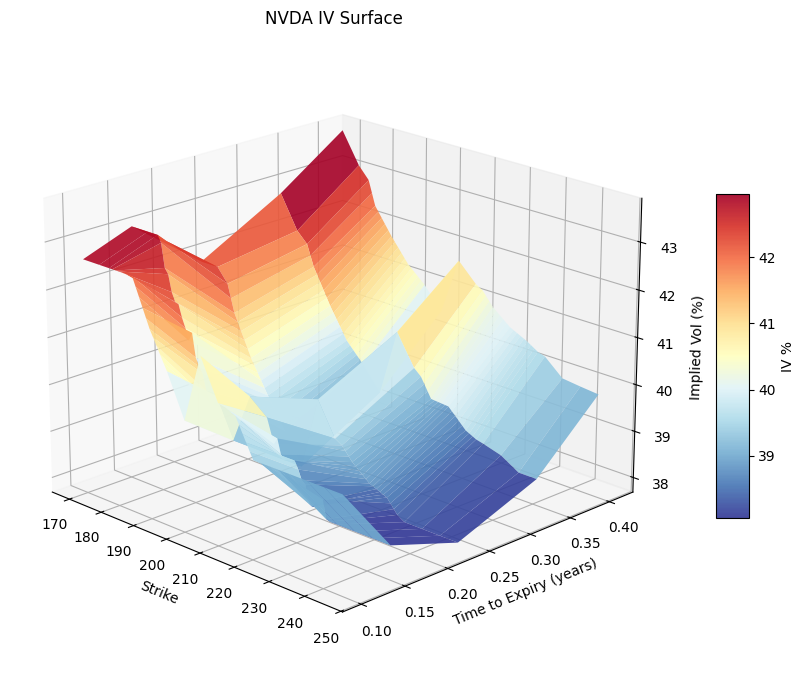
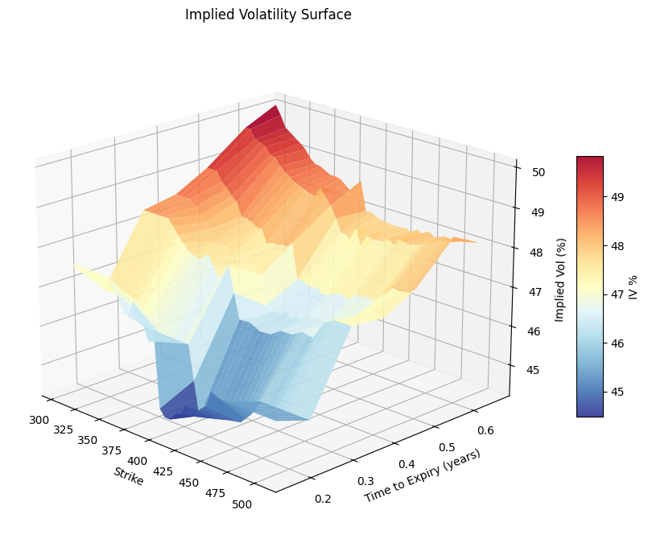
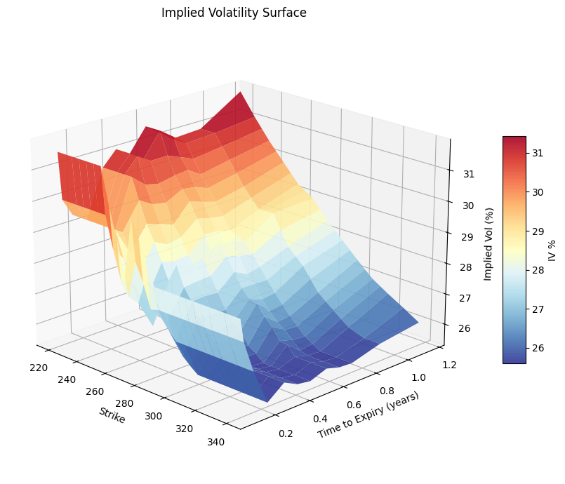
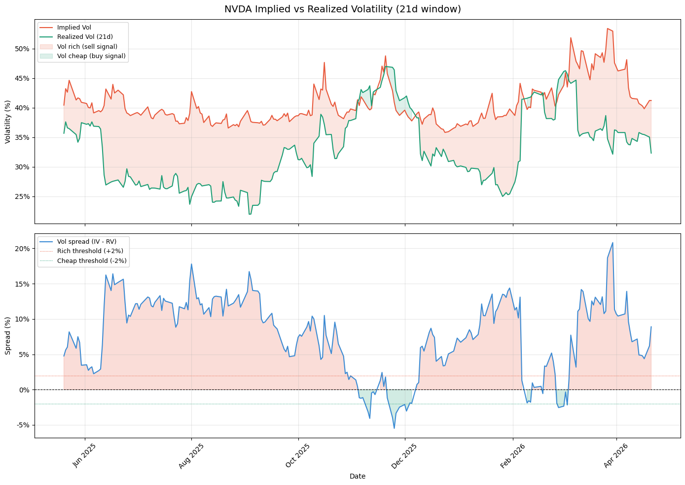

# volkit

**An open-source Python library for volatility analytics — pricing, IV surfaces, and variance risk premium analysis.**

*Personal project — built to implement and demonstrate the core tools used by volatility funds.*

---

## Overview

volkit provides a complete analytical pipeline for equity options volatility:

- fetch and clean real options chains and price history from multiple providers
- price European options and compute Greeks using Black-Scholes from scratch
- build implied volatility surfaces using Newton-Raphson inversion
- analyze the variance risk premium (IV − RV) to identify rich/cheap vol regimes

The main demonstrations live in two notebooks:

- `notebooks/demo.ipynb` — end-to-end pipeline walkthrough
- `notebooks/guide.ipynb` — detailed module guide with examples and analysis

---

## The Strategy — Variance Risk Premium

Options are systematically overpriced relative to realized volatility. The market consistently pays more for protection than volatility warrants. This gap is the **Variance Risk Premium**:

    VRP = IV − RV

When VRP > 0, options are expensive — the signal to sell volatility and collect premium.
When VRP < 0, options are cheap — the signal to stay flat or buy protection.

volkit implements every component of this pipeline from scratch.

---

## Modules

| Module | Purpose |
|--------|---------|
| **market_data** | Fetch options chains and price history from multiple providers |
| **black_scholes** | Black-Scholes pricer and all five Greeks implemented from scratch |
| **iv_surface** | IV surface builder using Newton-Raphson solver |
| **vol_spread** | Implied vs realized vol spread analyzer |
| **utils** | Shared utilities — real-time risk-free rate from US 3-month T-bill |

---

## Pipeline

    market_data  →  black_scholes  →  iv_surface  →  vol_spread
    Fetch data       Price options     Build surface   VRP signal

---

## Results

### Implied Volatility Surface

The surface shows volatility skew (OTM puts more expensive than OTM calls) and term structure (IV across expiries). Built using Newton-Raphson inversion of Black-Scholes on real market prices.










### Vol Spread — NVDA

Implied vol (red) vs realized vol (green) over time. The shaded area shows when vol is rich (sell signal) or cheap (buy signal).



---

## Quickstart

```python
from volkit import market_data
from volkit.iv_surface import plot_surface
from volkit.vol_spread import analyze_vol_spread

# fetch everything in one call
snapshot = market_data.get_market_snapshot("SPY")

# build and plot the IV surface
plot_surface(snapshot["options"], spot=snapshot["spot"], title="SPY IV Surface")

# analyze the variance risk premium
analyze_vol_spread(
    price_history=snapshot["price_history"],
    options=snapshot["options"],
    spot=snapshot["spot"],
    ticker="SPY",
    mode="vix_adjusted",
)
```

---

## Module Details

### market_data

Implements the provider pattern — an abstract base class defines a contract of three methods, and each provider implements it for a specific data source. The rest of the library never depends on a specific provider.

```python
# Yahoo Finance — no API key required
snapshot = market_data.get_market_snapshot("SPY")

# with date range and expiry filter
snapshot = market_data.get_market_snapshot(
    "SPY",
    start="2024-01-01",
    expiry_from="2026-05-01",
    expiry_to="2026-12-31"
)

# MarketData.app — includes Greeks
snapshot = market_data.get_market_snapshot(
    "SPY",
    provider="marketdata",
    api_key="your_key"
)
```

### black_scholes

Implemented from scratch — no external pricing libraries. Uses the closed-form Black-Scholes solution for European calls and puts.

```python
from volkit.black_scholes import bs_price, greeks
from volkit.utils import get_risk_free_rate

r = get_risk_free_rate()  # fetches US 3-month T-bill rate automatically

price = bs_price(S=710, K=715, T=30/365, r=r, sigma=0.18, option_type="call")
g     = greeks(S=710, K=715, T=30/365, r=r, sigma=0.18)
# {'delta': 0.42, 'gamma': 0.014, 'vega': 0.51, 'theta': -0.21, 'rho': 0.12}
```

### iv_surface

Inverts Black-Scholes using Newton-Raphson iteration. Uses the OTM convention — puts below spot, calls above spot — because OTM options are more liquid and their prices are more reliable.

```python
from volkit.iv_surface import plot_surface, build_iv_surface

# plot the full surface
plot_surface(snapshot["options"], spot=snapshot["spot"])

# get the surface as a DataFrame
surface = build_iv_surface(snapshot["options"], spot=snapshot["spot"])
```

### vol_spread

Compares implied vol to rolling realized vol to identify rich/cheap regimes.

**Why VIX as IV proxy?** Yahoo Finance does not provide historical options chains, so a daily IV time series cannot be reconstructed from raw option data. VIX is the CBOE's official daily measure of 30-day implied vol — the industry standard proxy.

**Basis adjustment:** our solver differs slightly from VIX (different underlying, strike selection). We measure this today and apply it as a correction:

    basis          = our_IV_today - VIX_today
    IV_adjusted(t) = VIX(t) + basis
    spread(t)      = IV_adjusted(t) - RV(t)

```python
from volkit.vol_spread import analyze_vol_spread

analyze_vol_spread(
    price_history=snapshot["price_history"],
    options=snapshot["options"],
    spot=snapshot["spot"],
    ticker="SPY",
    window=21,
    mode="vix_adjusted",   # "vix_adjusted" | "vix_raw" | "scalar"
    rich_threshold=0.02,
)
```

---

## Data Providers

| Provider | Price History | Options Chain | Greeks | API Key |
|----------|:---:|:---:|:---:|:---:|
| Yahoo Finance | ✓ | ✓ | ✗ | Not required |
| Massive | ✓ | Paid plan | ✗ | Required |
| MarketData.app | ✓ | ✓ | ✓ | Required (free tier) |

**Note:** Yahoo Finance does not provide liquid put options during market close — for IV surface construction, MarketData.app is recommended.

---

## Installation

```bash
pip install git+https://github.com/fedecarz/volkit.git
```

For local development:

```bash
git clone https://github.com/fedecarz/volkit.git
cd volkit
pip install -e .
```

---

## Repository Structure

```text
volkit/
│               
│
├── notebooks/
│   ├── demo.ipynb              # End-to-end pipeline demo
│   └── guide.ipynb             # Detailed module guide
│
├── assets/
│   ├── IV_surface.png          # IV surface screenshot
│   ├── NVDA_vol_spread.png     # Vol spread screenshot
│   └── .....
│
├── volkit/
│   ├── __init__.py
│   ├── black_scholes.py        # Black-Scholes pricer and Greeks
│   ├── iv_surface.py           # Newton-Raphson IV solver and surface builder
│   ├── vol_spread.py           # Variance risk premium analyzer
│   ├── utils.py                # Shared utilities
│   └── market_data/
│       ├── __init__.py         # Public API router
│       ├── base.py             # Abstract provider base class
│       └── providers/
│           ├── __init__.py
│           ├── yahoo.py
│           ├── massive_provider.py
│           └── marketdata_provider.py
│
├── setup.py
├── requirements.txt
└── README.md
```

---

## Requirements

Python 3.8+ · numpy · scipy · pandas · yfinance · matplotlib · massive · requests · python-dotenv

---

## Limitations and Natural Extensions

| Area | Current | Production extension |
|------|---------|---------------------|
| IV Surface | Raw Newton-Raphson IV | SVI / Heston |
| Realized Vol | Daily close-to-close returns | Intraday tick data |
| IV Time Series | VIX proxy with basis adjustment | Daily option snapshots in a database |
| Backtesting | Not implemented | P&L, Sharpe, max drawdown, tail risk |

---

## License

MIT
